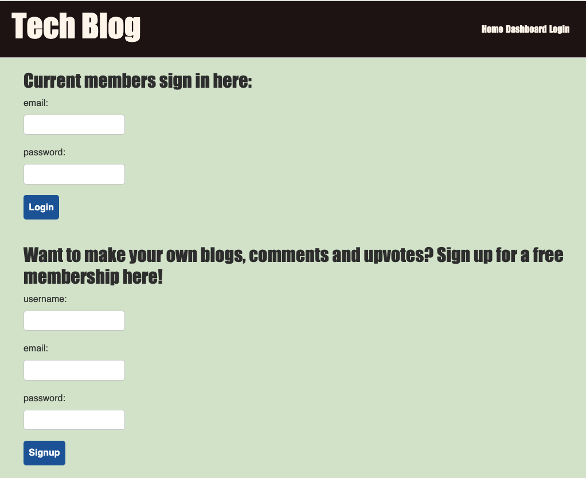

# tech-blog

## Description 
Tech Blog is an interactive, express.js, sequelize and mySql-driven application that captures user input in the form of blogs stored on a backend server. The blogs are each assigned a unique ID, and may be edited and deleted at the push of a button. Users may login to the server and upvote and comment on individual blog posts. 

## Deployed Application Link: https://afternoon-cove-12974.herokuapp.com/

## Table of Contents
* [Installation](#installation) 
* [Usage](#usage) 
* [License](#license) 
* [Contributing](#contributing)
* [Questions](#questions)

 
### Installation
  Clone or fork the code from the Tech-Blog repository on GitHub. Open the code in a standard code editing application, such as VS Code. Install npm and the following dependencies: 
  * bcrypt
  * connect-session-sequelize
  * dotenv
  * express
  * express-handlebars
  * express-session
  * jquery
  * mysql2
  * sequelize
  * jest
### Usage
 Open the deployed application via Heroku with the provided link above. On the home page, browse blog posts and comments freely. To create posts, comments, and upvotes, fill out the signup form to login. 
### License
  MIT
### Contributing
Tech Blog is an open source project, and anyone is encouraged to contribute by cloning or forking the code and working to improve its function and versatility.

### Questions
    
##### Interested in other projects from this developer? Visit the following GitHub profile:
https://github.com/jeffwjohn
    
##### Send any questions to the following email address:
jeffwjohn@yahoo.com